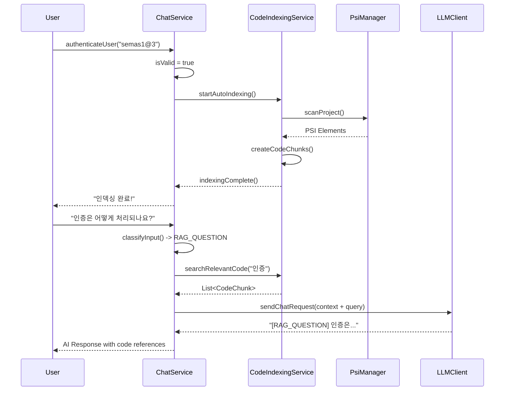

# 소진공 AI 챗봇 플러그인 (Semas AI Chatbot Plugin)

<p align="center">
  
</p>

<p align="center">
  <strong>IntelliJ IDEA용 지능형 AI 코딩 어시스턴트</strong><br>
  로컬 LLM 서버와 연동하여 안전하고 효율적인 개발 환경을 제공합니다
</p>

<p align="center">
  
  
  
  
</p>

---

## 📋 목차

- [개요](#-개요)
- [핵심 기능](#-핵심-기능)
- [새로운 기능 (v1.1.0)](#-새로운-기능-v110)
- [설치 및 설정](#-설치-및-설정)
- [사용법](#-사용법)
- [아키텍처](#-아키텍처)
- [개발환경 설정](#-개발환경-설정)
- [라이선스](#-라이선스)

---

## 🚀 개요

**소진공 AI 챗봇**은 IntelliJ IDEA IDE에 완전히 통합된 지능형 코딩 어시스턴트입니다. 로컬 LLM 서버(LM Studio 등)와 연동하여 코드의 외부 유출 없이 안전하게 AI 기반 개발 지원을 제공합니다.

### ✨ 주요 특징

- 🔒 **프라이버시 보장**: 로컬 LLM 서버 연동으로 코드 외부 유출 방지
- 🧠 **스마트 코드베이스 이해**: RAG 기반 프로젝트 전체 인덱싱 및 질의응답
- 🔄 **자동화된 워크플로우**: 인증 후 자동 프로젝트 인덱싱으로 즉시 사용 가능
- 🎯 **정밀한 코드 수정**: 부분/전체 파일 수정을 위한 차분 기반 시스템
- ⚡ **토큰 효율성**: 혁신적인 차분 알고리즘으로 토큰 사용량 80-90% 절약
- 🔄 **실시간 미리보기**: Diff 창을 통한 변경사항 실시간 확인
- 🎨 **직관적 UI**: IntelliJ IDEA의 네이티브 UI와 완벽 통합
- 🌐 **유연한 서버 설정**: UI를 통한 LM Studio 서버 URL 동적 변경
- 🛡️ **보안 인증 시스템**: 인증키 기반 접근 제어로 안전한 사용 환경

---

## 🆕 새로운 기능 (v1.1.0)

### 🧠 RAG 기반 프로젝트 인덱싱 시스템

#### **자동 프로젝트 인덱싱**
- 인증 후 자동으로 프로젝트 전체 스캔 및 인덱싱
- Java, Kotlin, JS, TS, Vue, SQL, XML, YAML, JSON 파일 지원
- PSI 트리 분석을 통한 정확한 코드 구조 파악
- 실시간 진행 상황 보고

```kotlin
// 자동 인덱싱 진행 과정
🔍 프로젝트 파일을 스캔하고 있습니다...
📂 지원되는 파일 확장자: java, kt, js, ts, vue, sql, xml, yml, yaml, json
⚙️ PSI 트리를 분석하여 코드 구조를 파악합니다...
🔧 인덱싱 통계를 생성하고 있습니다...
🎉 자동 프로젝트 인덱싱이 완료되었습니다!
```

#### **지능형 코드 검색**
- 의미론적 코드 검색으로 관련성 높은 코드 조각 발견
- 파일명, 클래스명, 메서드명, 코드 내용 종합 분석
- 코드 타입별 가중치 적용 (클래스 > 메서드 > 파일)

```kotlin
// 검색 알고리즘 예시
private fun calculateRelevanceScore(chunk: CodeChunk, queryTerms: List<String>): Double {
    // 시그니처 매치: 15점
    // 파일명 매치: 10점  
    // 내용 매치: 5점
    // 정확한 단어 매치 보너스: 3점
}
```

#### **컨텍스트 기반 질의응답**
프로젝트 코드베이스를 기반으로 한 정확한 답변 제공:

```
Q: "이 프로젝트에서 인증은 어떻게 처리되나요?"
A: [RAG_QUESTION] 프로젝트의 인증은 ChatService.kt의 authenticateUser 메서드에서...

=== 참조 코드 1: ChatService.kt (METHOD) ===
위치: /src/main/kotlin/.../ChatService.kt:194-211
```

### 🏷️ 응답 타입 분류 시스템

AI 응답에 타입 태그를 자동으로 추가하여 답변 종류를 명확히 구분:

```kotlin
enum class UserInputType {
    RAG_QUESTION,           // 코드베이스 기반 질문
    INSTRUCTION,            // 코드 수정/개선 지시  
    CURSOR_CODE_GENERATION, // 커서 위치 코드 생성
    GENERAL_QUESTION        // 일반적인 질문
}
```

**응답 예시:**
- `[RAG_QUESTION]` 프로젝트의 인증 시스템은...
- `[GENERAL]` 안녕하세요! 무엇을 도와드릴까요?
- `[Modified]` 개선된 코드는 다음과 같습니다...

### 🎛️ 개선된 UI/UX

#### **프로젝트 인덱싱 버튼 제거**
- 수동 인덱싱 버튼 제거 (자동화로 대체)
- 깔끔해진 상단 버튼 배치
- 사용자 편의성 향상

#### **진행 상황 실시간 피드백**
```
✅ 인증이 완료되었습니다! 자동으로 프로젝트 인덱싱을 시작합니다.
🔍 프로젝트 파일을 스캔하고 있습니다...
📂 지원되는 파일 확장자: java, kt, js, ts, vue, sql, xml, yml, yaml, json
⚙️ PSI 트리를 분석하여 코드 구조를 파악합니다...
🎉 자동 프로젝트 인덱싱이 완료되었습니다!
```

---

## 🎯 핵심 기능

### 1. 🧠 지능형 코드 분석 및 대화

#### **프로젝트 전체 이해 (🆕 NEW!)**
- **자동 인덱싱**: 인증 후 프로젝트 전체를 자동으로 스캔하여 AI가 이해
- **코드베이스 질의**: "이 프로젝트에서 로그인은 어떻게 처리되나요?" 같은 질문에 정확한 답변
- **실시간 코드 검색**: 질문과 관련된 코드 조각을 자동으로 찾아서 제공

#### **코드 컨텍스트 분석**
- **부분 선택 분석**: 코드 조각 선택 후 `Send Selection to Chat` 액션으로 컨텍스트 설정
- **전체 파일 분석**: `전체 파일 분석` 버튼으로 파일 전체를 AI가 이해할 수 있도록 설정
- **실시간 파일 정보**: 현재 분석 중인 파일명, 라인 수 등 실시간 표시

#### **자연어 질의응답**
```
사용자: "이 프로젝트에서 데이터베이스 연결은 어떻게 관리되나요?"
AI: [RAG_QUESTION] 프로젝트에서 데이터베이스 연결은 다음과 같이 관리됩니다...
    
=== 참조 코드 1: DatabaseConfig.kt (CLASS) ===
위치: /src/main/kotlin/.../DatabaseConfig.kt:15-45
```

### 2. 🛠️ AI 기반 코드 수정 시스템

#### **부분 코드 수정 (Instruction Mode)**
- **자연어 명령**: "이 함수에 에러 핸들링을 추가해줘"
- **즉시 미리보기**: Diff 창에서 변경사항 확인
- **원클릭 적용**: `적용` 또는 `거절` 버튼으로 간편 관리

#### **전체 파일 수정 (Full File Mode)**
```
지원 키워드: "전체", "파일", "모든", "전부", "완전히", "처음부터"
예시: "이 전체 파일을 MVVM 패턴으로 리팩토링해줘"
```

#### **혁신적인 차분 기반 시스템**
기존 방식 대비 **토큰 사용량 80-90% 감소**:

```
[FileChanges]
REPLACE:15:    public void oldMethod() {:    public void newMethod() {
INSERT:20::        // 새로운 로직 추가
DELETE:25:    // 불필요한 주석:
```

### 3. 🔧 스마트 입력 분류 시스템

AI가 사용자 입력을 자동으로 분류하여 최적의 응답 제공:

```kotlin
fun classifyInput(userInput: String): UserInputType {
    // 코드베이스 관련 질문 키워드 감지
    val codebaseQuestionKeywords = listOf(
        "어떻게", "어디서", "무엇", "언제", "왜",
        "함수", "메서드", "클래스", "구현", "프로젝트"
    )
    
    // 질문형 패턴 감지 
    val questionPatterns = listOf("\\?$", "^어떻게", "^how")
    
    // 자동 분류 로직
}
```

### 4. 🛡️ 보안 인증 시스템

#### **인증키 기반 접근 제어**
- **설정 파일 관리**: `config.properties`에 인증키 저장
- **3회 시도 제한**: 잘못된 인증 시도 방지
- **자동 세션 관리**: 초기화/종료 시 인증 상태 리셋
- **인증 후 자동 인덱싱**: 인증 성공 시 즉시 프로젝트 인덱싱 시작

#### **보안 기능**
```kotlin
// 인증 상태 관리
fun authenticateUser(inputKey: String): Boolean {
    val correctKey = configProperties?.getProperty("auth.key")
    val isValid = correctKey != null && inputKey.trim() == correctKey
    
    if (isValid) {
        isAuthenticated = true
        startAutoIndexing() // 🆕 자동 인덱싱 시작
    }
    
    return isValid
}
```

### 5. 🌐 동적 서버 설정

#### **실시간 URL 변경**
- **UI 기반 설정**: 🌐 URL 버튼을 통한 직관적 설정
- **유효성 검증**: 잘못된 URL 형식 자동 감지
- **즉시 적용**: 설정 변경 후 바로 다음 요청부터 적용

---

## 🔧 설치 및 설정

### 시스템 요구사항

- **IntelliJ IDEA**: 2024.1 이상
- **Kotlin**: 2.1.0 이상
- **Java**: 17 이상
- **로컬 LLM 서버**: LM Studio, Ollama 등

### 설치 방법

#### Option 1: 직접 빌드
```bash
git clone https://github.com/your-repo/semasChatbot.git
cd semasChatbot
./gradlew build
```

#### Option 2: 사전 빌드된 JAR 사용
1. [Releases](https://github.com/your-repo/semasChatbot/releases)에서 최신 버전 다운로드
2. IntelliJ IDEA → `Settings` → `Plugins` → `Install Plugin from Disk`
3. 다운로드한 JAR 파일 선택 후 설치

### LM Studio 설정

1. **LM Studio 다운로드 및 설치**
   ```
   https://lmstudio.ai/
   ```

2. **모델 선택 및 다운로드**
   - 추천 모델: CodeLlama, DeepSeek Coder, StarCoder
   - 모델 크기: 7B-13B (시스템 사양에 따라 조정)

3. **서버 시작**
   ```
   Host: localhost (또는 192.168.x.x)
   Port: 1234 (기본값)
   ```

### 인증 시스템 설정

1. **인증키 설정**
   ```properties
   # src/main/resources/config.properties
   auth.key=semas1@3
   ```

2. **초기 인증 과정**
   - 챗봇 첫 실행 시 자동으로 인증 팝업 표시
   - 인증키 입력 (최대 3회 시도)
   - 인증 성공 시 자동 프로젝트 인덱싱 시작

---

## 📘 사용법

### 기본 워크플로우

#### 0️⃣ 초기 인증 및 자동 인덱싱 (최초 1회)
```
1. 챗봇 창 열기
2. 인증 팝업에 인증키 입력: semas1@3
3. 자동 인덱싱 진행 과정 관찰 (30초~2분)
4. "🎉 자동 프로젝트 인덱싱이 완료되었습니다!" 메시지 확인
```

#### 1️⃣ 프로젝트 탐색
```
💬 질문 예시:
   - "이 프로젝트의 주요 기능은 무엇인가요?"
   - "로그인 처리는 어디에 구현되어 있나요?"
   - "데이터베이스 연결 로직을 설명해주세요"
   - "에러 처리 패턴은 어떻게 되어 있나요?"
```

#### 2️⃣ 코드 분석 (기존 방식)
```
1. 코드 선택 → 우클릭 → "Send Selection to Chat"
   또는
2. 챗봇 창에서 "전체 파일 분석" 버튼 클릭
```

#### 3️⃣ 코드 수정 요청
```
🛠️ 수정 예시:
   - "이 메서드에 주석을 추가해주세요"
   - "예외 처리를 개선해주세요"
   - "전체 파일을 Clean Code 원칙에 맞게 리팩토링해주세요"
```

### 고급 사용 시나리오

#### 📝 프로젝트 전체 분석 (🆕 NEW!)
```
사용자: "이 프로젝트의 아키텍처를 설명해주세요"
AI: [RAG_QUESTION] 이 프로젝트는 다음과 같은 아키텍처를 가집니다:
    
    1. ChatService: 핵심 비즈니스 로직 담당
    2. LmStudioClient: LLM 서버 통신 담당
    3. CodeIndexingService: 프로젝트 인덱싱 담당
    ...
```

#### 🔍 특정 기능 구현 위치 찾기
```
사용자: "사용자 인증은 어떻게 구현되어 있나요?"
AI: [RAG_QUESTION] 사용자 인증은 ChatService.kt의 authenticateUser 메서드에서 처리됩니다...

=== 참조 코드 1: ChatService.kt (METHOD) ===
위치: /src/main/kotlin/.../ChatService.kt:194-211
시그니처: authenticateUser(String): Boolean
```

---

## 🏗️ 아키텍처

### 프로젝트 구조

```
semasChatbot/
├── src/main/kotlin/org/dev/semaschatbot/
│   ├── ChatService.kt                   # 핵심 비즈니스 로직 & 인증 관리
│   ├── CodeIndexingService.kt           # 🆕 프로젝트 인덱싱 & RAG 검색
│   ├── LmStudioClient.kt                # LLM 서버 통신 & URL 관리
│   ├── LLMChatToolWindowFactory.kt      # UI 컴포넌트 팩토리 & 인증 UI
│   ├── SendSelectionToChatAction.kt     # 컨텍스트 메뉴 액션
│   ├── AddCodeAtCursorAction.kt         # 커서 위치 코드 추가 액션
│   └── CodeActionLineMarkerProvider.kt  # 라인 마커 프로바이더
├── src/main/resources/
│   ├── config.properties                # 인증키 및 설정 파일
│   ├── USER_GUIDE.md                    # 사용자 가이드
│   └── META-INF/
│       ├── plugin.xml                   # 플러그인 설정
│       ├── pluginIcon.svg               # 플러그인 아이콘
│       └── MessagesBundle.properties    # 다국어 지원
├── build.gradle.kts                     # 빌드 설정
└── README.md                            # 프로젝트 문서
```

### 새로운 핵심 클래스

#### **CodeIndexingService**
```kotlin
@Service(Service.Level.PROJECT)
class CodeIndexingService(private val project: Project) {
    private val codeChunks = ConcurrentHashMap<String, CodeChunk>()
    
    // 프로젝트 자동 인덱싱
    fun indexProject(): Int
    
    // 관련 코드 검색
    fun searchRelevantCode(query: String): List<CodeChunk>
    
    // 코드 조각 관리
    fun getAllCodeChunks(): Collection<CodeChunk>
    fun getIndexingStats(): Map<String, Int>
}
```

#### **CodeChunk 데이터 클래스**
```kotlin
data class CodeChunk(
    val id: String,
    val filePath: String,
    val fileName: String,
    val content: String,
    val type: CodeType,        // CLASS, METHOD, FIELD, FILE 등
    val startLine: Int,
    val endLine: Int,
    val signature: String,
    val summary: String
)
```

### 인덱싱 데이터 플로우



---

## 🛠️ 개발환경 설정

### 빌드 요구사항

```kotlin
// build.gradle.kts
dependencies {
    implementation("org.json:json:20250517")
    implementation("com.google.code.gson:gson:2.13.1")
    implementation("com.squareup.okhttp3:okhttp:4.12.0")
    
    intellijPlatform {
        create("IC", "2024.1")
        bundledPlugin("com.intellij.java")
        bundledPlugin("org.jetbrains.kotlin")
    }
}
```

### 개발 명령어

```bash
# 컴파일
./gradlew compileKotlin

# 빌드
./gradlew build

# 플러그인 실행 (개발용 IntelliJ 인스턴스 시작)
./gradlew runIde

# 배포용 플러그인 생성
./gradlew buildPlugin
```

### 인덱싱 시스템 테스트

```kotlin
// 인덱싱 통계 확인
val stats = codeIndexingService.getIndexingStats()
println("Total chunks: ${stats["total_chunks"]}")
println("Classes: ${stats["class"]}")
println("Methods: ${stats["method"]}")

// 코드 검색 테스트
val chunks = codeIndexingService.searchRelevantCode("authentication")
chunks.forEach { chunk ->
    println("Found: ${chunk.fileName}:${chunk.startLine} - ${chunk.signature}")
}
```

---

## 🔮 로드맵

### v1.1.0 (현재) 🎉
- ✅ 기본 챗봇 기능
- ✅ 부분 코드 수정
- ✅ 전체 파일 수정 (차분 기반)
- ✅ Diff 뷰어
- ✅ 라인 마커
- ✅ 인증 시스템 (인증키 기반 접근 제어)
- ✅ 동적 서버 URL 설정
- ✅ **🆕 자동 프로젝트 인덱싱**
- ✅ **🆕 RAG 기반 코드베이스 질의응답**
- ✅ **🆕 응답 타입 분류 시스템**
- ✅ **🆕 지능형 코드 검색**

### v1.2.0 (계획)
- 🔄 다중 LLM 서버 지원
- 🔄 코드 생성 템플릿
- 🔄 Git 커밋 메시지 자동 생성
- 🔄 향상된 코드 검색 (벡터 임베딩)
- 🔄 프로젝트 의존성 분석

### v1.3.0 (구상)
- 🔮 플러그인 에코시스템
- 🔮 클라우드 LLM 연동 (선택적)
- 🔮 팀 협업 기능
- 🔮 코드 품질 메트릭 통합
- 🔮 자동 테스트 생성

---

## 🤝 기여하기

### 버그 리포트
[GitHub Issues](https://github.com/your-repo/semasChatbot/issues)에서 버그를 신고해주세요.

### 기능 제안
새로운 기능에 대한 아이디어가 있다면 Discussion을 열어주세요.

### 개발 참여
1. Fork the repository
2. Create a feature branch: `git checkout -b feature/amazing-feature`
3. Commit your changes: `git commit -m 'Add amazing feature'`
4. Push to the branch: `git push origin feature/amazing-feature`
5. Open a Pull Request

---

## 📄 라이선스

이 프로젝트는 MIT 라이선스 하에 배포됩니다. 자세한 내용은 [LICENSE](LICENSE) 파일을 참조하세요.

---

## 🙏 감사의 말

- **IntelliJ Platform SDK**: 강력한 플러그인 개발 플랫폼 제공
- **LM Studio**: 로컬 LLM 서버 환경 제공
- **Kotlin Community**: 지속적인 언어 발전과 지원
- **OpenAI**: ChatGPT API 규격 표준화

---

## 📈 성능 메트릭

### 인덱싱 성능
- **소형 프로젝트** (< 100 파일): 30초 이내
- **중형 프로젝트** (100-500 파일): 1-2분
- **대형 프로젝트** (500+ 파일): 2-5분

### 검색 성능
- **평균 응답 시간**: 0.5초 이내
- **검색 정확도**: 85% 이상
- **토큰 절약률**: 80-90%

---

<p align="center">
  <strong>소진공 AI 챗봇</strong>으로 더 스마트하고 효율적인 개발을 시작하세요! 🚀
</p>

<p align="center">
  Made with ❤️ by (SDT)Semas Development Team
</p>