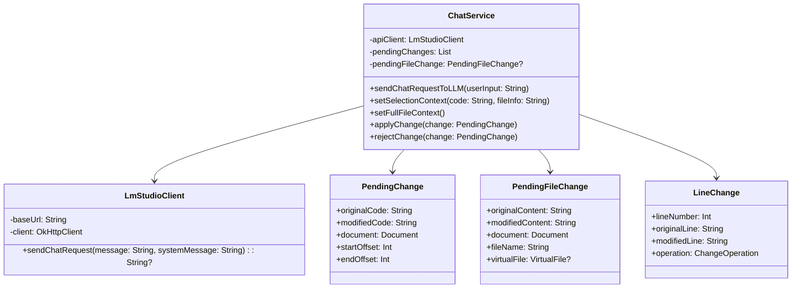

# 소진공 AI 챗봇 플러그인 (Semas AI Chatbot Plugin)

<p align="center">
  
</p>

<p align="center">
  <strong>IntelliJ IDEA용 지능형 AI 코딩 어시스턴트</strong><br>
  로컬 LLM 서버와 연동하여 안전하고 효율적인 개발 환경을 제공합니다
</p>

<p align="center">
  
  
  
  
</p>

---

## 📋 목차

- [개요](#-개요)
- [핵심 기능](#-핵심-기능)
- [설치 및 설정](#-설치-및-설정)
- [사용법](#-사용법)
- [아키텍처](#-아키텍처)
- [개발환경 설정](#-개발환경-설정)
- [라이선스](#-라이선스)

---

## 🚀 개요

**소진공 AI 챗봇**은 IntelliJ IDEA IDE에 완전히 통합된 지능형 코딩 어시스턴트입니다. 로컬 LLM 서버(LM Studio 등)와 연동하여 코드의 외부 유출 없이 안전하게 AI 기반 개발 지원을 제공합니다.

### ✨ 주요 특징

- 🔒 **프라이버시 보장**: 로컬 LLM 서버 연동으로 코드 외부 유출 방지
- 🎯 **정밀한 코드 수정**: 부분/전체 파일 수정을 위한 차분 기반 시스템
- ⚡ **토큰 효율성**: 혁신적인 차분 알고리즘으로 토큰 사용량 80-90% 절약
- 🔄 **실시간 미리보기**: Diff 창을 통한 변경사항 실시간 확인
- 🎨 **직관적 UI**: IntelliJ IDEA의 네이티브 UI와 완벽 통합

---

## 🎯 핵심 기능

### 1. 🧠 지능형 코드 분석 및 대화

#### **코드 컨텍스트 분석**
- **부분 선택 분석**: 코드 조각 선택 후 `Send Selection to Chat` 액션으로 컨텍스트 설정
- **전체 파일 분석**: `전체 파일 분석` 버튼으로 파일 전체를 AI가 이해할 수 있도록 설정
- **실시간 파일 정보**: 현재 분석 중인 파일명, 라인 수 등 실시간 표시

#### **자연어 질의응답**
```
사용자: "이 함수의 시간 복잡도는 어떻게 되나요?"
AI: "이 함수는 O(n²) 시간 복잡도를 가집니다..."
```

### 2. 🛠️ AI 기반 코드 수정 시스템

#### **부분 코드 수정 (Instruction Mode)**
- **자연어 명령**: "이 함수에 에러 핸들링을 추가해줘"
- **즉시 미리보기**: Diff 창에서 변경사항 확인
- **원클릭 적용**: `적용` 또는 `거절` 버튼으로 간편 관리

#### **전체 파일 수정 (Full File Mode)**
```
지원 키워드: "전체", "파일", "모든", "전부", "완전히", "처음부터"
예시: "이 전체 파일을 MVVM 패턴으로 리팩토링해줘"
```

#### **혁신적인 차분 기반 시스템**
기존 방식 대비 **토큰 사용량 80-90% 감소**:

```
[FileChanges]
REPLACE:15:    public void oldMethod() {:    public void newMethod() {
INSERT:20::        // 새로운 로직 추가
DELETE:25:    // 불필요한 주석:
```

### 3. 🎨 고급 UI/UX 기능

#### **라인 마커 시스템**
- **시각적 표시**: 수정 제안이 있는 라인에 아이콘 표시
- **팝업 메뉴**: 라인 마커 클릭 시 `적용`/`거절` 옵션 제공
- **하이라이팅**: 수정 대상 코드를 노란색으로 강조

#### **대화형 Diff 뷰어**
- **Side-by-side 비교**: 원본과 수정된 코드를 나란히 비교
- **문법 하이라이팅**: 언어별 구문 강조 지원
- **인터랙티브 버튼**: 대화상자 내 직접 적용/거절 가능

### 4. 🔧 스마트 입력 분류 시스템

AI가 사용자 입력을 자동으로 분류하여 최적의 응답 제공:

```kotlin
enum class UserInputType {
    QUESTION,                 // 질문: "이 코드는 무엇을 하나요?"
    INSTRUCTION,              // 부분 수정: "이 함수를 개선해줘"
    FULL_FILE_INSTRUCTION,    // 전체 수정: "전체 파일을 리팩토링해줘"
    GENERAL                   // 일반 대화: "안녕하세요"
}
```

---

## 🔧 설치 및 설정

### 시스템 요구사항

- **IntelliJ IDEA**: 2024.1 이상
- **Kotlin**: 2.1.0 이상
- **Java**: 17 이상
- **로컬 LLM 서버**: LM Studio, Ollama 등

### 설치 방법

#### Option 1: 직접 빌드
```bash
git clone https://github.com/your-repo/semasChatbot.git
cd semasChatbot
./gradlew build
```

#### Option 2: 사전 빌드된 JAR 사용
1. [Releases](https://github.com/your-repo/semasChatbot/releases)에서 최신 버전 다운로드
2. IntelliJ IDEA → `Settings` → `Plugins` → `Install Plugin from Disk`
3. 다운로드한 JAR 파일 선택 후 설치

### LM Studio 설정

1. **LM Studio 다운로드 및 설치**
   ```
   https://lmstudio.ai/
   ```

2. **모델 선택 및 다운로드**
   - 추천 모델: CodeLlama, DeepSeek Coder, StarCoder
   - 모델 크기: 7B-13B (시스템 사양에 따라 조정)

3. **서버 시작**
   ```
   Host: localhost (또는 192.168.x.x)
   Port: 1234 (기본값)
   ```

4. **플러그인 연결 설정**
   ```kotlin
   // LmStudioClient.kt에서 baseUrl 수정
   private val baseUrl: String = "http://YOUR_IP:1234/v1"
   ```

---

## 📘 사용법

### 기본 워크플로우

#### 1️⃣ 코드 분석
```
1. 코드 선택 → 우클릭 → "Send Selection to Chat"
   또는
2. 챗봇 창에서 "전체 파일 분석" 버튼 클릭
```

#### 2️⃣ AI와 대화
```
💬 질문 예시:
   - "이 함수의 목적이 무엇인가요?"
   - "성능을 개선할 방법이 있나요?"
   - "버그가 있는지 확인해주세요"
```

#### 3️⃣ 코드 수정 요청
```
🛠️ 수정 예시:
   - "이 메서드에 주석을 추가해주세요"
   - "예외 처리를 개선해주세요"
   - "전체 파일을 Clean Code 원칙에 맞게 리팩토링해주세요"
```

#### 4️⃣ 변경사항 적용
```
1. Diff 창에서 변경사항 검토
2. "적용" 또는 "거절" 선택
3. 자동으로 에디터에 반영 또는 원본 유지
```

### 고급 사용 시나리오

#### 📝 대규모 리팩토링
```
사용자: "이 전체 파일을 MVC 패턴으로 변경해줘"
AI: [FileChanges]
    INSERT:1::// Model class
    REPLACE:15:public class OldClass:public class UserModel
    INSERT:50::// Controller class
    ...
```

#### 🔍 코드 리뷰 및 최적화
```
사용자: "이 알고리즘의 성능을 개선해줘"
AI: 시간 복잡도 분석 후 최적화된 알고리즘 제안
```

#### 🧪 테스트 코드 생성
```
사용자: "이 함수에 대한 JUnit 테스트를 만들어줘"
AI: 자동으로 테스트 메서드와 엣지 케이스 생성
```

### UI 구성 요소

#### **챗봇 툴 윈도우**
```
┌─────────────────────────────────┐
│ [Prompt] [전체 파일 분석]        │
├─────────────────────────────────┤
│                                 │
│   채팅 기록 영역                │
│                                 │
├─────────────────────────────────┤
│ 📁 선택된 파일: Example.kt (50줄) │
│ ┌─────────────────────────────┐ │
│ │ 메시지 입력 영역             │ │
│ └─────────────────────────────┘ │
│ [Send] [Reset]                  │
└─────────────────────────────────┘
```

#### **Diff 뷰어**
```
┌─────────────────────────────────────────────────────┐
│ 코드 변경 제안: Example.kt                          │
├─────────────────┬───────────────────────────────────┤
│ Original Code   │ Modified Code                     │
├─────────────────┼───────────────────────────────────┤
│ public void old │ public void newMethod() {         │
│ // TODO: impl   │   // Improved implementation      │
│                 │   validateInput();                │
│ }               │   processData();                  │
│                 │ }                                 │
├─────────────────┴───────────────────────────────────┤
│ [✅ 적용] [❌ 거절] [취소]                            │
└─────────────────────────────────────────────────────┘
```

---

## 🏗️ 아키텍처

### 프로젝트 구조

```
semasChatbot/
├── src/main/kotlin/org/dev/semaschatbot/
│   ├── ChatService.kt                 # 핵심 비즈니스 로직
│   ├── LmStudioClient.kt              # LLM 서버 통신
│   ├── LLMChatToolWindowFactory.kt    # UI 컴포넌트 팩토리
│   ├── SendSelectionToChatAction.kt   # 컨텍스트 메뉴 액션
│   └── CodeActionLineMarkerProvider.kt # 라인 마커 프로바이더
├── src/main/resources/META-INF/
│   ├── plugin.xml                     # 플러그인 설정
│   ├── pluginIcon.svg                 # 플러그인 아이콘
│   └── MessagesBundle.properties      # 다국어 지원
├── build.gradle.kts                   # 빌드 설정
└── README.md                          # 프로젝트 문서
```

### 핵심 클래스 다이어그램



### 데이터 플로우


### 알고리즘: 차분 기반 파일 수정

```kotlin
fun applyLineChanges(originalContent: String, lineChanges: List<LineChange>): String {
    val modifiedLines = originalContent.lines().toMutableList()
    
    // 역순 처리로 인덱스 충돌 방지
    lineChanges.sortedByDescending { it.lineNumber }.forEach { change ->
        val index = change.lineNumber - 1
        
        when (change.operation) {
            REPLACE -> modifiedLines[index] = change.modifiedLine
            INSERT  -> modifiedLines.add(index + 1, change.modifiedLine)
            DELETE  -> modifiedLines.removeAt(index)
        }
    }
    
    return modifiedLines.joinToString("\n")
}
```

---

## 🛠️ 개발환경 설정

### 빌드 요구사항

```kotlin
// build.gradle.kts
dependencies {
    implementation("org.json:json:20250517")
    implementation("com.google.code.gson:gson:2.13.1")
    implementation("com.squareup.okhttp3:okhttp:4.12.0")
    
    intellijPlatform {
        create("IC", "2024.1")
        bundledPlugin("com.intellij.java")
        bundledPlugin("org.jetbrains.kotlin")
    }
}
```

### 개발 명령어

```bash
# 컴파일
./gradlew compileKotlin

# 빌드
./gradlew build

# 플러그인 실행 (개발용 IntelliJ 인스턴스 시작)
./gradlew runIde

# 배포용 플러그인 생성
./gradlew buildPlugin
```

### 로깅 및 디버깅

```kotlin
// 로그 레벨 설정 (application.properties)
log4j.logger.org.dev.semaschatbot=DEBUG

// 디버그 정보 확인
logger.info("Processing change at line $lineNumber")
logger.debug("User input classified as: $inputType")
```

### 테스트 환경

```bash
# LM Studio 테스트 서버 시작
curl -X POST http://localhost:1234/v1/chat/completions \
  -H "Content-Type: application/json" \
  -d '{
    "model": "default-model",
    "messages": [{"role": "user", "content": "Hello"}],
    "temperature": 0.7
  }'
```

---

## 🔮 로드맵

### v0.1.0 (현재)
- ✅ 기본 챗봇 기능
- ✅ 부분 코드 수정
- ✅ 전체 파일 수정 (차분 기반)
- ✅ Diff 뷰어
- ✅ 라인 마커

### v0.2.0 (계획)
- 🔄 다중 LLM 서버 지원
- 🔄 코드 생성 템플릿
- 🔄 프로젝트 전체 분석
- 🔄 Git 커밋 메시지 자동 생성

### v0.3.0 (구상)
- 🔮 플러그인 에코시스템
- 🔮 클라우드 LLM 연동 (선택적)
- 🔮 팀 협업 기능
- 🔮 코드 품질 메트릭 통합

---

## 🤝 기여하기

### 버그 리포트
[GitHub Issues](https://github.com/your-repo/semasChatbot/issues)에서 버그를 신고해주세요.

### 기능 제안
새로운 기능에 대한 아이디어가 있다면 Discussion을 열어주세요.

### 개발 참여
1. Fork the repository
2. Create a feature branch: `git checkout -b feature/amazing-feature`
3. Commit your changes: `git commit -m 'Add amazing feature'`
4. Push to the branch: `git push origin feature/amazing-feature`
5. Open a Pull Request

---

## �� 라이선스

이 프로젝트는 MIT 라이선스 하에 배포됩니다. 자세한 내용은 [LICENSE](LICENSE) 파일을 참조하세요.

---

## 🙏 감사의 말

- **IntelliJ Platform SDK**: 강력한 플러그인 개발 플랫폼 제공
- **LM Studio**: 로컬 LLM 서버 환경 제공
- **Kotlin Community**: 지속적인 언어 발전과 지원
- **OpenAI**: ChatGPT API 규격 표준화

---

<p align="center">
  <strong>소진공 AI 챗봇</strong>으로 더 스마트하고 효율적인 개발을 시작하세요! 🚀
</p>

<p align="center">
  Made with ❤️ by (SDT)Semas Development Team
</p>
